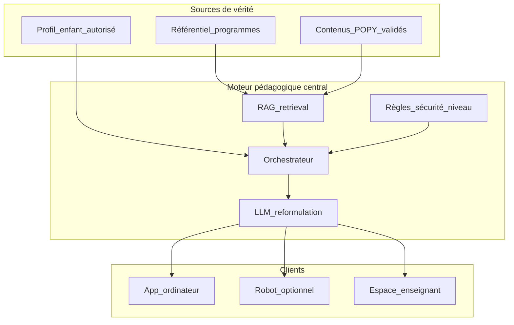

# Plan — Moteur pédagogique POPY (RAG + IA contrôlée)

> Objectif : une IA qui **ne mémorise pas** les programmes dans ses poids, mais
> s’appuie sur un **référentiel officiel contrôlé**, des **contenus POPY validés**
> et le **profil enfant autorisé**.  
> Hors scope immédiat : hébergement prod, fine-tuning, robot physique.

## Principe figé (non négociable)

```
Question enfant / adulte
        ↓
  Garde-fous (âge, rôle, consentement)
        ↓
  Recherche référentiel officiel (RAG)
        ↓
  Recherche contenus POPY validés
        ↓
  Contexte profil / progression (minimisé)
        ↓
  LLM = reformulation + dialogue UNIQUEMENT
        ↓
  Réponse sourcée + limites explicites
```

**Interdit :** le LLM invente le programme (« je pense que le BO dit… »).  
**Si le RAG ne trouve rien :** réponse contrôlée de refus / report enseignant.

Phrase jury :

> POPY n’entraîne pas son IA sur Internet. Son moteur s’appuie sur un référentiel
> contrôlé issu des programmes officiels, enrichi de contenus validés. L’IA
> reformule et accompagne **dans les limites** de ce référentiel.

---

## Architecture cible



Trois bases distinctes :

| Base | Contenu | Usage IA |
|------|---------|----------|
| **A — Référentiel officiel** | Cycles, domaines, compétences, attendus (Éduscol / BO structurés) | RAG « vérité programme » |
| **B — Contenus POPY** | Leçons, exercices, indices, corrections, adaptations | RAG + sélection d’activité |
| **C — Profil / progression** | XP, maîtrise, adaptations efficaces, durée séances | Personnalisation **autorisée** |

LLM = 4ᵉ composant (raisonnement / dialogue), **pas** source de vérité.

---

## Phases d’exécution (ordre strict)

### Phase P0 — Cadrage & contrats

- [ ] Documenter les contrats TypeScript du moteur (`PedagogicalQuery`, `RetrievalHit`, `GroundedAnswer`)
- [ ] Définir les intents : `programme`, `exercice`, `aide`, `remediation`, `bilan`
- [ ] Règle : intent `programme` → retrieval obligatoire, sinon refus
- [ ] Mettre à jour `BACKEND_SPECIFICATIONS.md` § IA avec ce modèle
- [ ] Créer tracker `PEDAGOGICAL_AI_TRACKER.md` (cases à cocher)

**Livrable :** contrats + tracker, zéro LLM encore.

---

### Phase P1 — Référentiel officiel (base A)

Structurer (exemple) :

```
CM1 → Mathématiques → Nombres et calculs → Fractions
        → compétences / attendus / objectifs / cycle / source BO
```

- [ ] Schéma Prisma : `curriculum_nodes`, `official_competencies`, `official_sources`
- [ ] Champs : `level`, `subject`, `domain`, `label`, `expected_outcomes`, `source_ref`, `version`
- [ ] Import **échantillon** CP–CM2 (maths + français d’abord) — données anonymes / publiques structurées
- [ ] API `GET /curriculum/tree`, `GET /curriculum/search?q=`
- [ ] Index de recherche (Postgres `tsvector` ou embeddings locaux plus tard)
- [ ] Tests : recherche « fractions CM1 » retourne nœuds sourcés

**Livrable :** référentiel interrogeable, pas d’invention LLM.

---

### Phase P2 — Contenus POPY validés (base B)

Chaîne :

```
Objectif officiel → Objectif POPY → Exercice → Correction → Indice → Explication → Adaptations
```

- [ ] Étendre entités : lier `learning_contents` / packs à `official_competency_id`
- [ ] Variantes : facile / standard / visuel / consigne simplifiée / audio / remédiation
- [ ] Statut validation : `DRAFT | REVIEWED | INSTITUTIONAL` (déjà amorcé côté front)
- [ ] Seed : packs démo liés au référentiel (pas de données personnelles)
- [ ] API `GET /contents?competency_id=`, `GET /contents/:id`
- [ ] Remplacer progressivement la banque hardcodée `src/data/curriculum.ts` par l’API (+ cache IndexedDB hors ligne)

**Livrable :** exercices POPY ancrés sur compétences officielles.

---

### Phase P3 — Profil & progression (base C)

- [ ] Agrégat lecture seule pour le moteur : `child_learning_context`
  - niveau, compétence, taux réussite, adaptation efficace, dernière durée
- [ ] Respect RBAC + consentements (pas de données médicales / diagnostic)
- [ ] API interne `GET /children/:id/learning-context` (parent / enseignant / enfant self)
- [ ] Minimisation : payload borné, pas de carnet privé dans le prompt IA

**Livrable :** contexte enfant injectable au moteur, audité.

---

### Phase P4 — RAG & orchestrateur (sans LLM d’abord)

- [ ] Service `retrieveOfficial(query, filters)` → top-k chunks sourcés
- [ ] Service `retrieveContents(competencyId, profileHints)` → variantes adaptées
- [ ] Service `buildGroundedPrompt(hits, profile, intent)`
- [ ] Mode **stub** : réponse template à partir des hits (pas de LLM) pour tests E2E
- [ ] Endpoint `POST /pedagogy/ask` :
  - entrée : `child_id?`, `message`, `intent?`, `level?`
  - sortie : `answer`, `sources[]`, `content_ids[]`, `grounded: true|false`
- [ ] Si 0 hit officiel sur intent programme → `grounded: false` + message fixe
- [ ] Tests unitaires retrieval + refus hors référentiel

**Livrable :** moteur pédagogique testable **sans** clé LLM.

---

### Phase P5 — LLM comme reformulateur uniquement

- [ ] Adapter LLM (OpenAI / Mistral / local) derrière interface `LlmClient`
- [ ] System prompt verrouillé : « Tu ne cites le programme que depuis SOURCES. Sinon refuse. »
- [ ] Température basse ; max tokens borné
- [ ] Journaliser : prompt version, model id, sources utilisées (pas le profil brut complet)
- [ ] Feature flag `PEDAGOGY_LLM_ENABLED` (off par défaut en CI)
- [ ] Tests : mock LLM + assert presence de `sources` dans la réponse

**Livrable :** dialogue personnalisé **ancré**.

---

### Phase P6 — Intégration front (ordinateur d’abord)

- [ ] Brancher « Parler à Popy » / aide aux devoirs sur `POST /pedagogy/ask`
- [ ] Afficher sources (« D’après le référentiel CM1 — Fractions »)
- [ ] Fallback hors ligne : packs IndexedDB déjà téléchargés (pas d’IA réseau)
- [ ] Espace enseignant : prévisualiser / valider réponses avant diffusion
- [ ] Robot : **même** endpoint plus tard (optionnel, jamais bloquant)

**Livrable :** enfant sur PC utilise le moteur réel.

---

### Phase P7 — Qualité, éthique, jury

- [ ] Jeu de tests « anti-hallucination » (questions piège hors programme)
- [ ] Checklist validation humaine des contenus
- [ ] Doc AIPD / consentement pour contexte enfant dans les prompts
- [ ] Interdire diagnostics médicaux automatiques (déjà dans la spec)
- [ ] Optionnel **plus tard** : fine-tuning sur paires validées POPY (pas sur le BO)

**Livrable :** dossier pédagogique + démo jury.

---

## Stack technique proposée (alignée repo)

| Couche | Choix |
|--------|--------|
| API | Fastify existant (`/pedagogy/*`, `/curriculum/*`) |
| Données | Prisma + PostgreSQL (déjà là) |
| Recherche v1 | Postgres full-text + filtres niveau/matière |
| Recherche v2 | Embeddings (pgvector) si besoin qualité |
| LLM | Client abstrait + flag ; stub en CI |
| Front | React existant + cache IndexedDB |
| Robot | Consomme le même moteur (phase ultérieure) |

---

## Ce qu’on ne fait **pas** maintenant

- Hébergement UE / Stripe prod
- Fine-tuning massif
- Entraînement sur Internet / scraping libre
- IA qui invente le programme
- Robot obligatoire

---

## Ordre de démarrage concret (prochaine session)

1. **P0** contrats + tracker  
2. **P1** schéma référentiel + import échantillon maths CM1  
3. **P2** lier 5–10 packs POPY aux compétences  
4. **P4** `POST /pedagogy/ask` en mode stub grounded  
5. **P6** brancher le chat enfant sur cet endpoint  
6. **P5** brancher un LLM derrière le flag  

---

## Critères de « done » pour une démo crédible

- [ ] Question programme → réponse **toujours** sourcée ou refus  
- [ ] Exercice proposé lié à une compétence officielle  
- [ ] Profil enfant influence la **variante**, pas le programme inventé  
- [ ] Même API utilisable plus tard par le robot  
- [ ] Fonctionne sur **ordinateur sans robot**  
- [ ] Tests automatisés retrieval + anti-hallucination  

---

## Lien avec l’existant

- Front : `src/data/curriculum.ts` → migrer vers API (garder cache local)
- Backend : tables `competencies`, `learning_contents`, `activities`, `competency_evidence` déjà amorcées → les **aligner** sur le référentiel officiel
- Spec : enrichir §9 IA de `BACKEND_SPECIFICATIONS.md`
- Roadmap app : section « Moteur pédagogique / RAG » à ajouter
